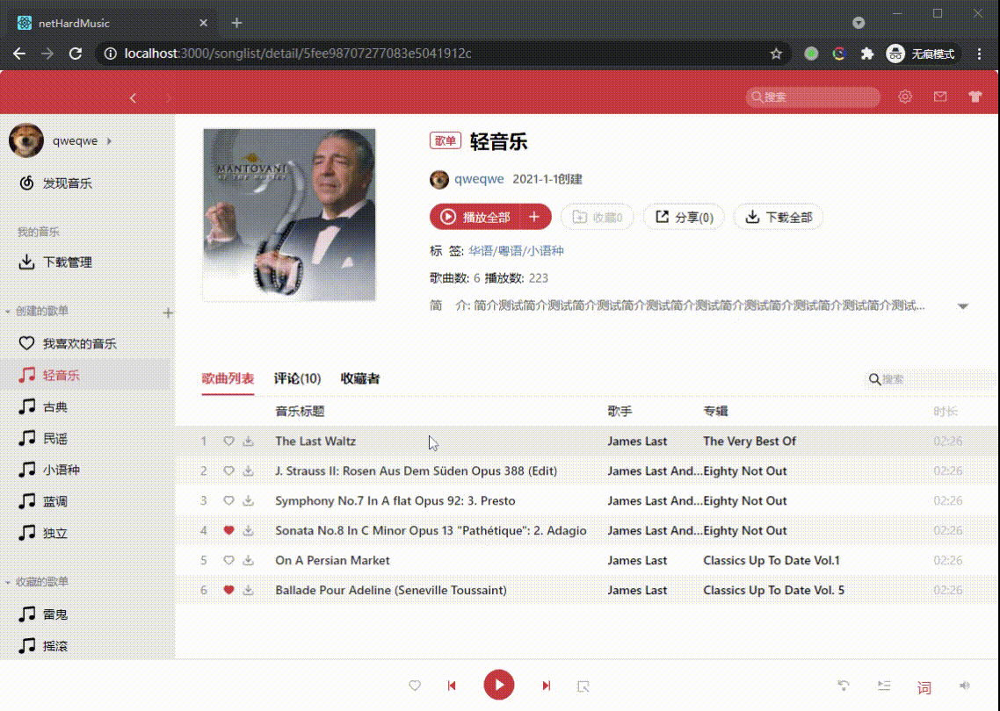
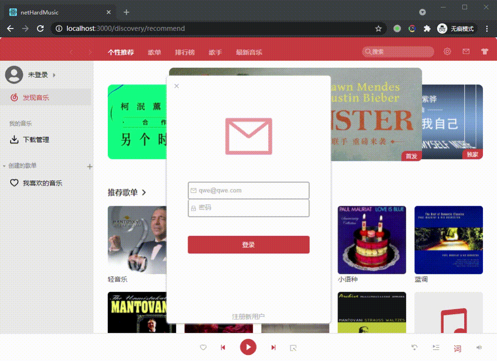
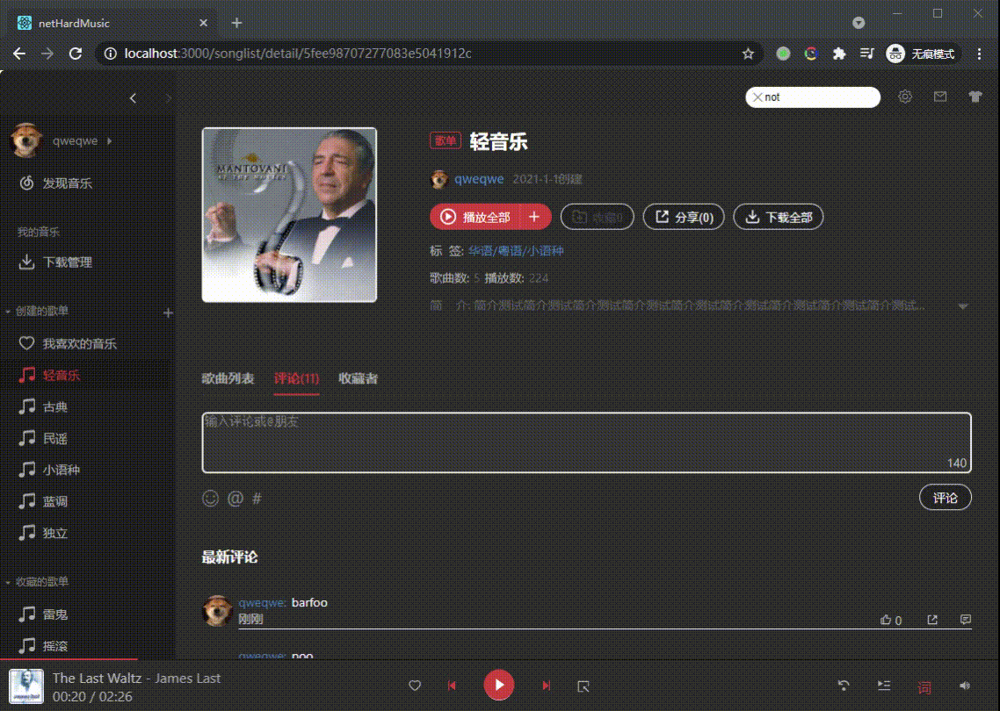
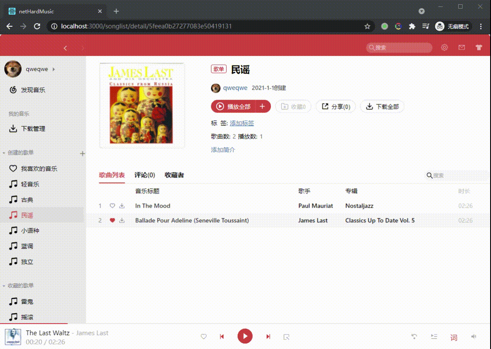

# netHardMusic
仿网易云音乐demo
```
environment: Linux version 4.18.0-301.1.el8.x86_64  
dependencies: nodejs npm@6 docker docker-compose
stack: React全家桶 + express.js + mongoose + mongodb + Cypress
```
## How to run
```
git clone https://github.com/pag233/netHardMusic
cd netHardMusic && docker-compose up  
默认页面位置http://localhost:3000  
.env文件配置docker端口映射  
测试账号: qwe@qwe.com:qweqweqwe
```
## 截屏
### 播放


### 登录


### 评论


### 头像


### banner


### 列表


### 搜索


### 标签



## 总结
- 入门玩具级，尤其是组件复用；别笑应该有比我差的
- cypress确实比selenium方便,国内用的相对少...写完才知道POM在cypress中是anti-designs
- 没考虑过兼容,感觉又是一个大坑
- 其实完全没有必要用Router...
- 明白为啥不爱写单元测试了
- 一开始写api时发现比前端上手,后来发现是达克效应,人菜瘾大
- 最后发现都是达克效应
